# Localization Optimization for UAVs Using Graph Algorithms

## Overview  
This project focuses on **real-time localization optimization** for unmanned aerial vehicles (UAVs) using **graph-based optimization** techniques. It integrates **GPS and IMU data** to enhance position accuracy, leveraging factor graph optimization to minimize localization errors.  

## Features  
- **Graph-Based Localization Optimization**: [GTSAM](https://github.com/borglab/gtsam) C++ factors graph library.  
- **Integration with ROS & PX4**: Compatible with **Robot Operating System (ROS)** and **PX4 autopilot** for seamless UAV control.  
- **Simulation & Visualization**: Supports **Gazebo simulation** and **RVIZ visualization** for real-time trajectory monitoring.  
- **Containerized Environment**: Built using **Docker** for easy deployment and reproducibility.  

## Results
The statistical analysis involved examining plots and calculating error metrics such as **RMSE (Root Mean Squared Error)** and **SD (Standard Deviation)**. A Python program was developed to compute trajectory errors and generate visualizations:  
- **3D plots** to track the trajectory.
- **2D plots** displaying the distance between the optimized and true trajectories over time.  
  
These visualizations were created using the **Matplotlib** library, while mathematical operations were performed with **NumPy**. The trajectory colors are consistent with RVIZ visualization:  
- **Blue** - True trajectory.  
- **Red** - Simulated GPS trajectory (noisy trajectory).  
- **Green** - Optimized trajectory.  

Additionally, error metrics for the simulated GPS trajectory were computed for comparison:

| Metric | Value |
|--------|-------|
| **SD** | 0.1464 |
| **RMSE** | 0.4860 |

The system was tested under three different scenarios:   

### 1. Trajectory Results Using GPS Only
| | |
|:-------------------------:|:-------------------------:|
| 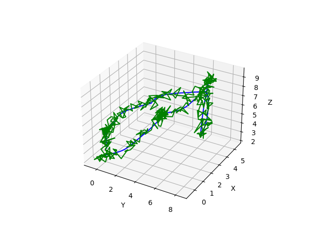 | 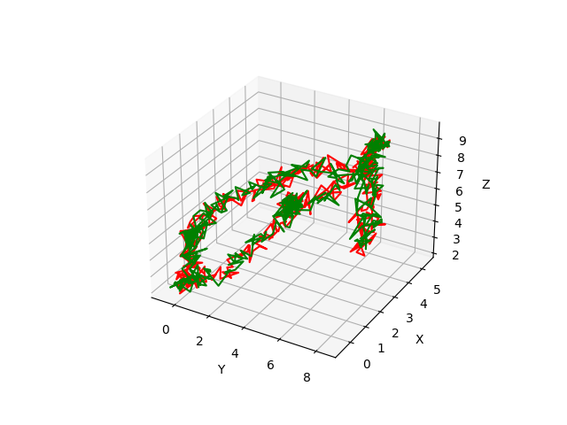 |
| a) Real and optimized trajectories. | b) Noisy and optimized trajectories. |
| 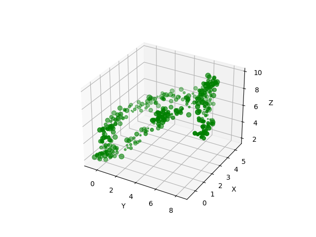 | 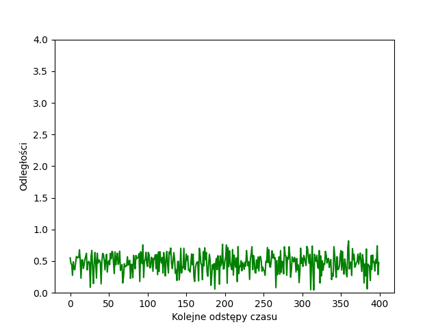 |
| c) Point-wise trajectory of the optimized path, where point size represents the distance from the true position. | d) Plot of the distance between the optimized position and the true position over successive time intervals. |

| Metric | Value |
|--------|-------|
| **SD** | 0.1466 |
| **RMSE** | 0.4917 |

### 2. Trajectory Results Using IMU Only  
| | |
|:-------------------------:|:-------------------------:|
| 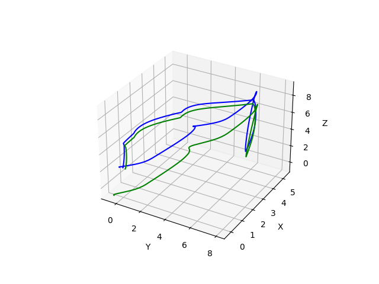 | 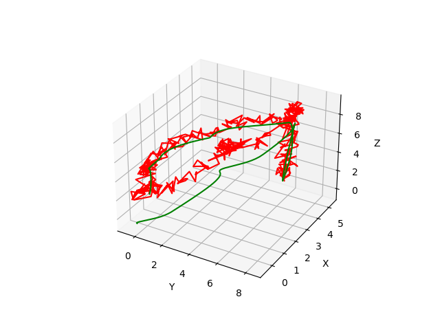 |
| a) Real and optimized trajectories. | b) Noisy and optimized trajectories. |
| 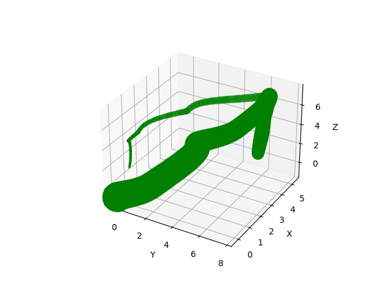 | 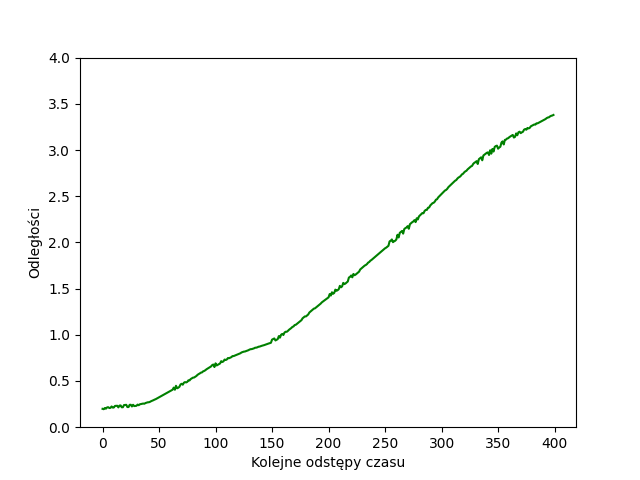 |
| c) Point-wise trajectory of the optimized path, where point size represents the distance from the true position. | d) Plot of the distance between the optimized position and the true position over successive time intervals. |

| Metric | Value |
|--------|-------|
| **SD** | 1.0279 |
| **RMSE** | 1.8808 |

### 3. Trajectory Results Using GPS + IMU (Optimized)  
| | |
|:-------------------------:|:-------------------------:|
| 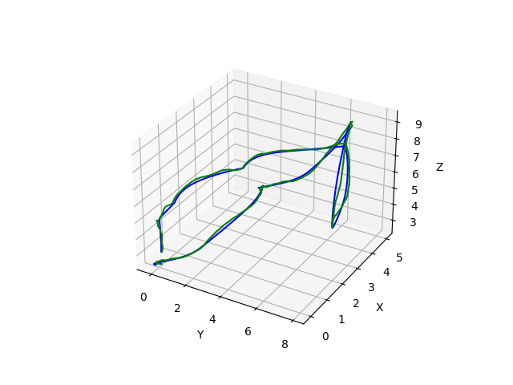 | 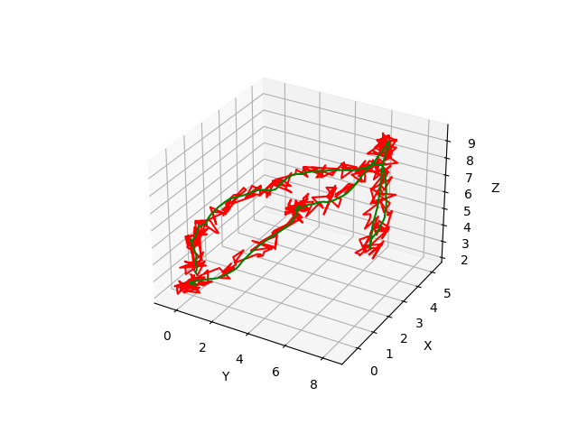 |
| a) Real and optimized trajectories. | b) Noisy and optimized trajectories. |
| 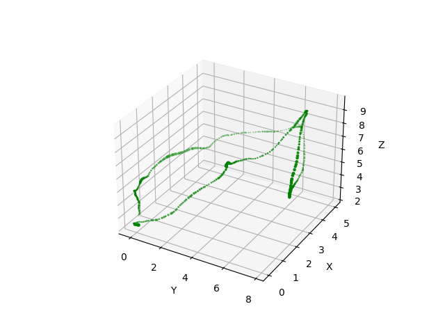 | 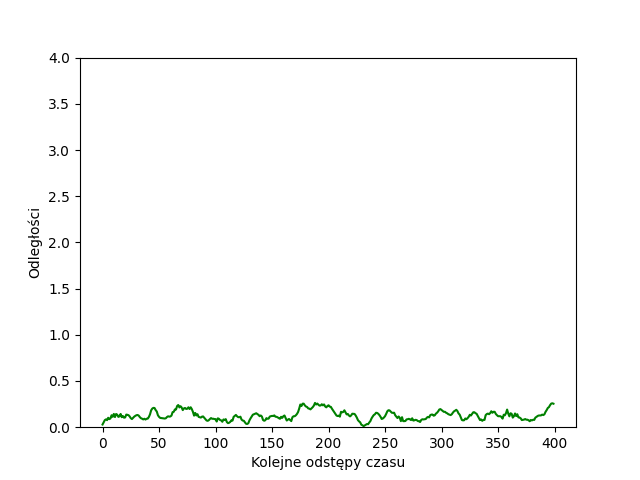 |
| c) Point-wise trajectory of the optimized path, where point size represents the distance from the true position. | d) Plot of the distance between the optimized position and the true position over successive time intervals. |

| Metric | Value |
|--------|-------|
| **SD** | 0.0511 |
| **RMSE** | 0.1374 |

#### Key Findings  
- **GPS alone** provided unstable positioning due to lack of odometry constraints.  
- **IMU alone** drifted significantly over time, causing large positioning errors.  
- **GPS + IMU fusion** significantly improved localization.  

## Technologies  
- **Languages**: C++ (for graph optimization), Python (for system integration)  
- **Frameworks**: ROS Noetic, PX4 Autopilot  
- **Simulation & Visualization**: Gazebo 11, RVIZ  
- **Containers**: Docker

## Future Work  
- Extending support to **UWB-based localization**.  
- Enhancing performance for **real-world UAV missions**.  
- Expanding compatibility with **additional sensors** (a.g. camera, radio distance).  
